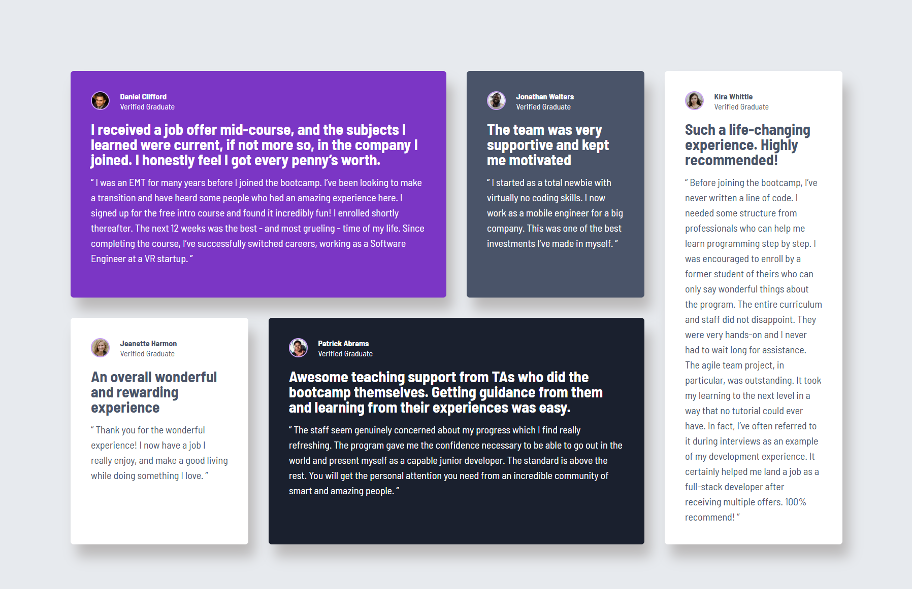
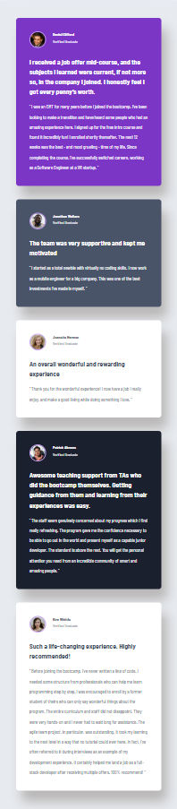

# Fully Responsive Testimonials Grid Section Solution

This is my solution to the [Testimonials Grid Section Challenge on Frontend Mentor](https://www.frontendmentor.io/challenges/testimonials-grid-section-Nnw6J7Un7).  
Frontend Mentor challenges help developers improve their front-end coding skills by building real projects.

## The Challenge

Users should be able to:

- View the optimal layout for the section depending on their device’s screen size.

## Final Result

### Desktop `1440px`

### Mobile `320px`

### Built With

- Semantic **HTML5** markup  
- **CSS custom properties**  
- **CSS Grid** for layout  
- **Flexbox** for smaller layout adjustments  
- **Utopia type and space scales** for fluid typography and spacing  
- **Mobile-first** responsive workflow  
- Relative units (`fr`, `clamp()`, `%`) instead of fixed pixels  

### What I Learned

In this project, my main goal was to recreate the Frontend Mentor design as closely as possible while keeping the code simple, scalable, and fully responsive.

I improved my understanding of:
- How to build **responsive grid layouts** using `grid-template-columns`, `grid-template-rows`, `grid-column` and `grid-row`.
- The importance of **avoiding fixed units** like `px` and instead using proportional values (`fr`, `clamp()`, etc.) for better scalability.
- Using **Utopia’s type and space scales** to maintain consistent rhythm and hierarchy across different screen sizes.
- Reducing **media queries** by relying on the natural flexibility of CSS Grid and fluid units.

### Continued Development

Moving forward, I’d like to:

- Practice advanced CSS Grid techniques (e.g., auto-placement, grid-template-areas).
- Explore fluid typography using the clamp() function in more complex projects.
- Continue refining my responsive design workflow to minimize media queries even further.
- Experiment with CSS logical properties for better adaptability in multilingual layouts.
 
### Final Thoughts

This project really helped me solidify my understanding of CSS Grid and fluid design principles.
I’m proud of how clean and minimal the final code is — it achieves responsiveness and proportional scaling without relying on rigid breakpoints or pixel-based values.

### Author
Developed by **Ana Mateus Neves**

- GitHub: [@anamateusn](https://github.com/anamateusn)
- Frontend Mentor: [@anamateusn](https://www.frontendmentor.io/profile/anamateusn)

### Thanks for checking ✌️